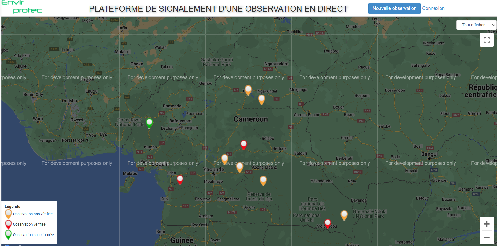

# LIVE OBSERVATION REPORTING PLATFORM

This at the first was build to report animal poaching and environment destruction in Cameroon. But the project has been extended and turn to open source
to allow any person any where to report everithyng that are anormal in environment, in conflict area, on city,in rural area and everything that is violation 
of human or animal living and rigth.

## Technology
the project use php, javascrip, mysql. the project use googlemap api and openstreetmap
## Installation
After downloading the project and unzipping it on the www directory, just create a database on your mysql databae server.
import database.sql located in database directory to your newly created database.
In the root directory, open config.php and add your credential to connect to your database. Then you can launch your plattform to your prefered browser.
## Contribution
every body want to contribute to this project, just send email to pavtino@gmail.com
</img>
